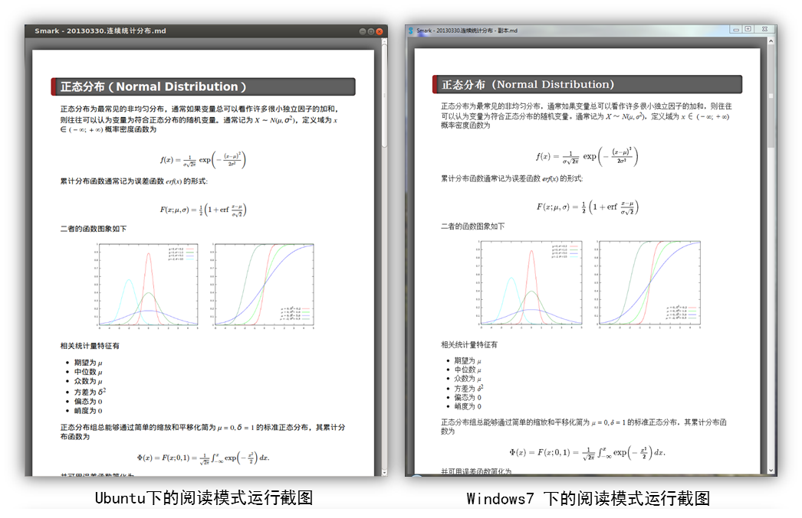
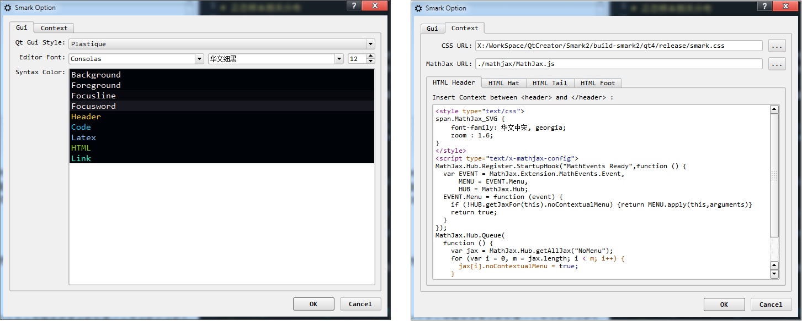

# 简洁的 Markdown 编辑器 Smark

说白了只是为了自己方便使用，并没什么新奇的东西。我使用 [pandoc](http://johnmacfarlane.net/pandoc/) 来转化 `markdown`，但是我不想在修改文件时总是在编辑器、文字终端和浏览器间换来换去，因此我写了一个简单的编辑器，它在后台调用 `pandoc` 将当前编辑的 `markdown` 内容转化为 `HTML`，而后将 `HTML` 在 `smark` 中的浏览器中显示出来，就是这么回事。Smark 依赖于 [`pandoc`](http://johnmacfarlane.net/pandoc/)、[`Qt 4.8`](http://qt-project.org/) 和 [`MathJax`](http://www.mathjax.org)，在此向上述软件包开发者们致敬。请注意继承于 pandoc 的发布协议，Smark 同样遵循 [GPL](http://www.gnu.org/copyleft/gpl.html)，如有任何疑问请联系 [elerao.ao@gmail.com](elerao.ao@gmail.com)，我将尽快做出回复。

主要特性：

 + `Windows` / `Linux` 等主流系统跨平台支持；
 + 完美支持 `LaTex` 数学公式、脚注、尾注等，支持使用本地 `MathJax` 调用，不需要在线访问 `MathJax CDN`；
 + 用户可配置的 `Markdown` 语法高亮显示，美观整洁；
 + 多种格式文件导出支持，可将当前 `Markdown` 文件另存为 `HTML`、 `Miscrosoft Word`、`OpenOffice / LibreOffice ODT Document`、`Latex`、`PDF`、`reStructured Text`、`Media Wiki markup`、`epub` 以及 `plain txt` 等格式文件输出；
 + 可通过用户指明 `CSS` 文件定义显示式样；
 + 简洁友好的界面布局，尽可能地凸显正在编辑的内容；
 + 系统、完备的各类快捷键，极大地提高了工作效率；

## 安装 Smark

 对于 `Windows` 平台，您可以直接下载当前版本的可执行程序 [Smark-X.X-Win32-portable.zip](http://pan.baidu.com/s/1ntMCVFV)。对于其它平台的用户，可以下载当前版本的 Smark 源代码 [Smark-X.X-src.zip](http://pan.baidu.com/s/1ntMCVFV)在本平台上进行编译即可，一般地您可以按照如下步骤编译 `Smark`：

 1. 安装依赖的程序包:

        $ sudo apt-get install qtsdk
        $ sudo apt-get install pandoc

    如果您不使用 `apt-get` 作为软件包管理器，自己谷歌搜索如何安装这两个程序包

 2. 下载 Smark 源代码 [Smark-X.X-src.zip](http://pan.baidu.com/s/1ntMCVFV)，解压并编译:

        $ qmake -project
        $ qmake
        $ make

 3. 把编译出的可执行文件移动到您的 `[bin]` 路径下即可使用，此时 `Smark` 将使用默认的 `CSS` 样式表和基于 `MathJax CDN` 的 `MathJax` 访问。如果想要得到与 `Windows` 平台下完全一致的体验，您还需下载 [smark-2.0-resource.zip](http://pan.baidu.com/s/1ntMCVFV) 解压倒 `Smark` 的安装目录下并进行设置。

## Smark 的运行截图

 
 Windows 7 下的 Smark 运行截图
 
 
 Windows 7 下的 Smark 配置选项对话框

## Smark 的快捷键列表

全局

    Esc              : 逐步隐藏所有不必要的部件，退出全屏显示
    Tab              : 增加所选诸行的缩进（四个空格）
    Ctrl + Tab       : 减小所选诸行的缩进（四个空格）

文件菜单

    Ctrl + N         : 新建 markdown 文件
    Ctrl + O         : 打开 markdown 文件
    Ctrl + S         : 保存当前 markdown 文件
    Ctrl + Shift + S : 将当前文件另存为支持的格式
    Ctrl + W         : 关闭当前 markdown 文件
    Ctrl + P         : 打印当前 markdown 文件
    Ctrl + Q         : 退出 Smark 

视图菜单

    F6               : 预览模式视图
    F7               : 阅读模式视图
    F8               : 编辑模式视图
    F11              : 进入 / 退出全屏显示

编辑菜单

    F5               : 刷新 HTML 显示
    Ctrl + Shift + C : 查看 HTML 源代码
    Ctrl + C         : 复制
    Ctrl + X         : 剪切
    Ctrl + P         : 粘贴
    Ctrl + Z         : 撤消
    Ctrl + Y         : 重做
    Ctrl + F         : 查找

插入菜单

    Ctrl + Shift + P : 插入图片
    Ctrl + Shift + L : 插入链接
    Ctrl + Shift + M : 插入数学公式

格式菜单

    Ctrl + B         : 加粗
    Ctrl + I         : 倾斜
    Ctrl + U         : 下划线
    Ctrl + ]         : 加大字号
    Ctrl + [         : 减小字号
    Ctrl + Down      : 下标
    Ctrl + Up        : 上标
    Ctrl + `         : 代码
    Ctrl + '         : 引用
    Ctrl + L         : 内容左对齐
    Ctrl + R         : 内容右对齐
    Ctrl + E         : 内容居中

## TODO List

### 现有问题：

 + 在 Qt5 下编译的 WebView 无法完整地加载 CSS 中的设置，Qt4 下没问题；
 + 改动后的 Markdwon 语法高亮的超链接 和 加粗 的正则表达式匹配有问题；
 + 导出 PDF 和打印时的内容分页问题；

### 待添加功能

 + 仿照 QtCreator 3.1.xx 中编辑器的多行同时编辑实现，支持 Sublime 等软件所支持的多行同时编辑；
 + 与 百度云、Google Drive、OneDrive 内容同步，这个以后再说；

 
